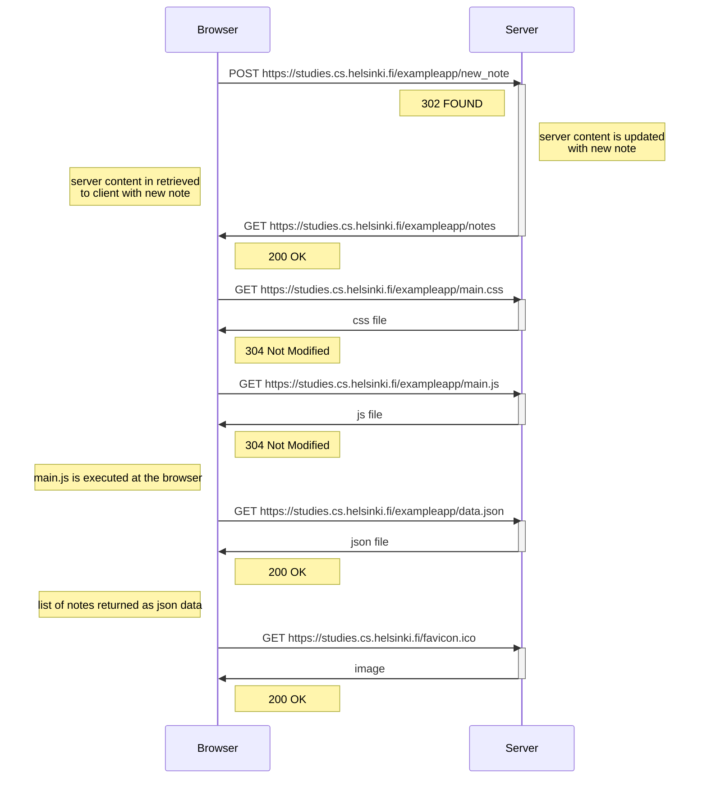
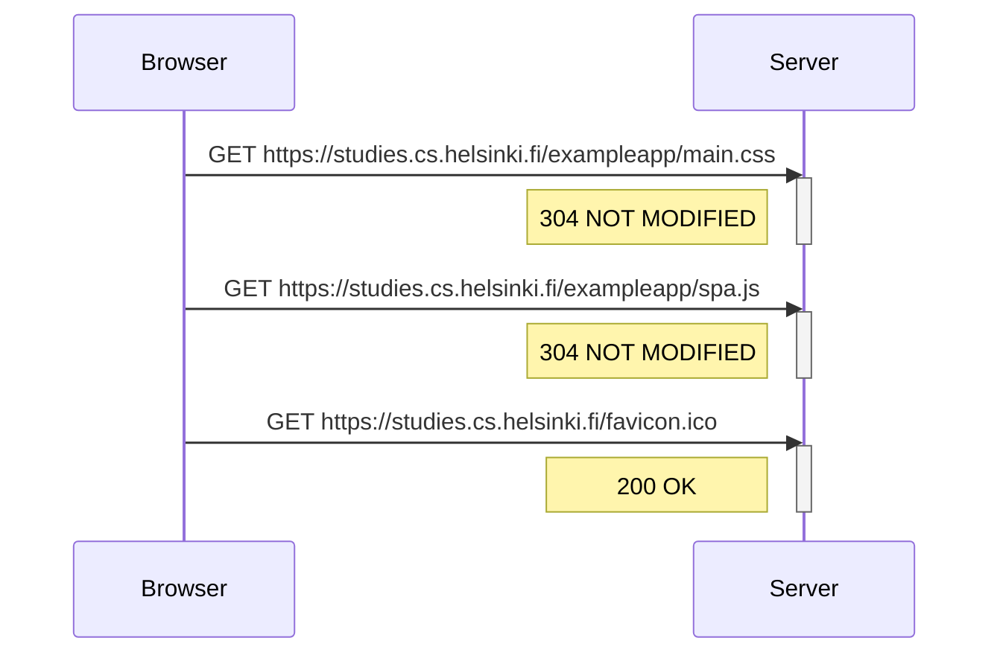
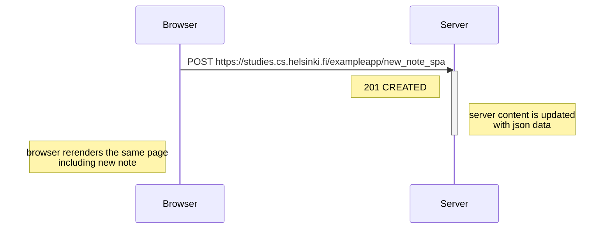

# fso-part0
Full Stack Open exercises from Part 0 of the curriculum

## 0.4: New note diagram 

## 0.5: Single page app diagram

## 0.6: New note in Single page app diagram

### Reference
*[GET - HTTP | MDN](https://developer.mozilla.org/en-US/docs/Web/HTTP/Methods/GET)*
*[POST - HTTP | MDN](https://developer.mozilla.org/en-US/docs/Web/HTTP/Methods/POST)*
*[200 OK - HTTP | MDN](https://developer.mozilla.org/en-US/docs/Web/HTTP/Status/200)*
*[201 Created - HTTP | MDN](https://developer.mozilla.org/en-US/docs/Web/HTTP/Status/201)*
*[304 Not Modified - HTTP | MDN](https://developer.mozilla.org/en-US/docs/Web/HTTP/Status/304)*

